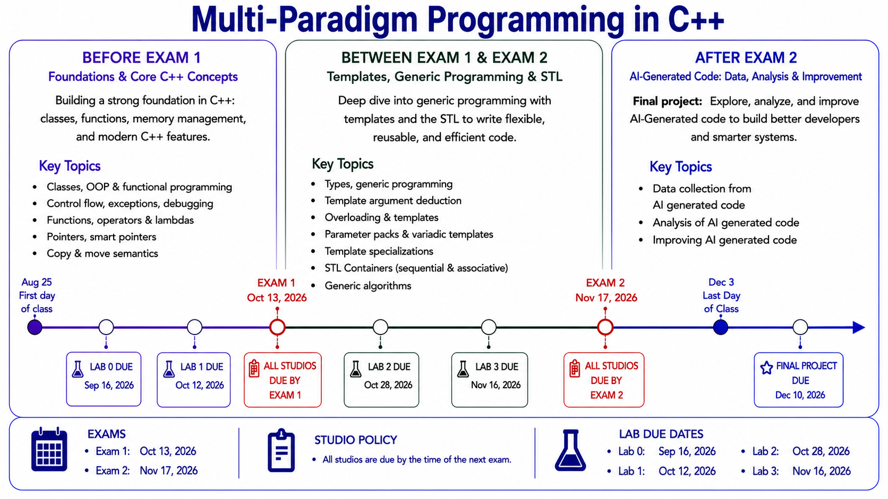

# CSE 428S: Multi-Paradigm Programming in C++
### Course Introduction

Department of Computer Science & Engineering
Washington University in St. Louis

---

## What This Class Is About

- How C++ features support **procedural, functional, object-oriented, and generic** programming
- Modern C++ (C++11 and beyond): templates, move semantics, smart pointers, lambdas, and more
- How to **combine** these paradigms to design real solutions

Full details, learning objectives, and grading are all in the **syllabus** on Canvas.

---

## The Shape of the Course

- **Studios** — short, hands-on, in-class
- **Labs 0–3** — build on each other, culminating in a final project
- **2 Exams** — in-class, paper-based
- **Special Project** — your lab solution vs. a GenAI solution

Weights, deadlines, late policy, regrading — **all in the syllabus**. I won't read it to you today; go read it this week.

---

## Before We Get Into the Syllabus Weeds...

I want to talk about something more important than deadlines.

### How you're actually going to learn in this course.

---

## Learning Is a Process, Not an Output

This course is built around **studios and labs** — not because busywork is fun, but because:

- You build understanding by *doing*, struggling a little, and fixing what's broken
- The "aha" moment happens *during* the work, not when you look at a finished answer
- Skipping the struggle means skipping the part where the learning happens

---

## Picture This

You join a gym.

You want to get stronger.

So every time you're due for a set of bench presses...

**you use a forklift to lift those weights.**

---

## The Forklift Lifts the Weight

- The weight gets moved.
- The rep gets "completed."
- **You get zero stronger.** 

The point was never moving the weight.
The point was what moving the weight *did to you*.

---

## Or Picture This

You sign up for piano lessons.

Every week, instead of practicing...

**you play a recording of someone else playing the piece.**

It sounds perfect. Your teacher hears music.

You still can't play a single note.

---

## Don't fall for this trap

**The assignment being "done" and you having "learned" are not the same thing.**

---

## So — About AI in This Course

AI tools are powerful, and you'll use them plenty in your career. This isn't about fear of the tool.

It's about **when** you reach for it.

DO:
- Ask GenAI to explain an error you hit
- Use it to understand a concept you're stuck on

AVOID:
- Asking GenAI to complete a studio or lab *for* you
- Submitting AI output as your own understanding

(Full academic integrity policy — you guessed it — **in the syllabus**.)

---

## Why I Actually Care About This

Not because of rules. Because of what's coming:

- Exams are yours alone, no AI, just you and your notes
- Labs **build on each other** — Lab 0's understanding is Lab 3's foundation
- The Special Project asks you to **critique AI-generated code** — you can't critique what you don't understand

If you let AI lift the weights all semester, you'll be asked to bench press unassisted — and you won't be able to.

---

## The Deal

- I'll give you real feedback
- Use every resource — textbook, me, even AI — to help you *understand*
- Just don't let anything **do the understanding for you**

You're not here to produce completed assignments.
You're here to become someone who can write this code.

---

---
## Next Steps

1. **Read the syllabus** this week — structure, grading, policies, all of it
2. Get your **GitHub** and **WashU Gemini** accounts set up
3. Start **Studio 0** to set up your environment

Questions? Ask now, or anytime.

# Let's start building.
