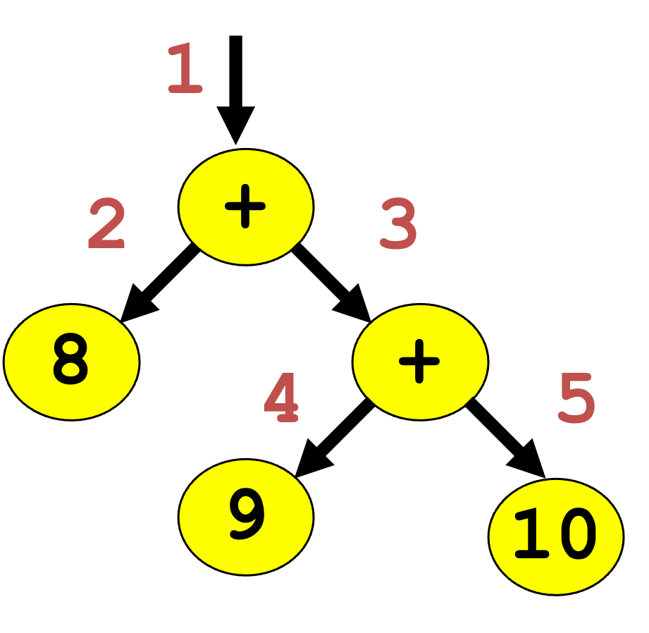
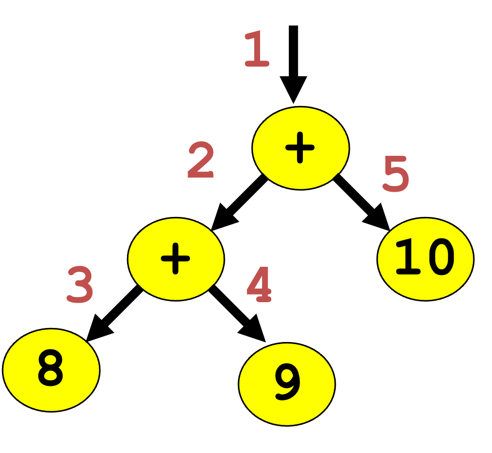
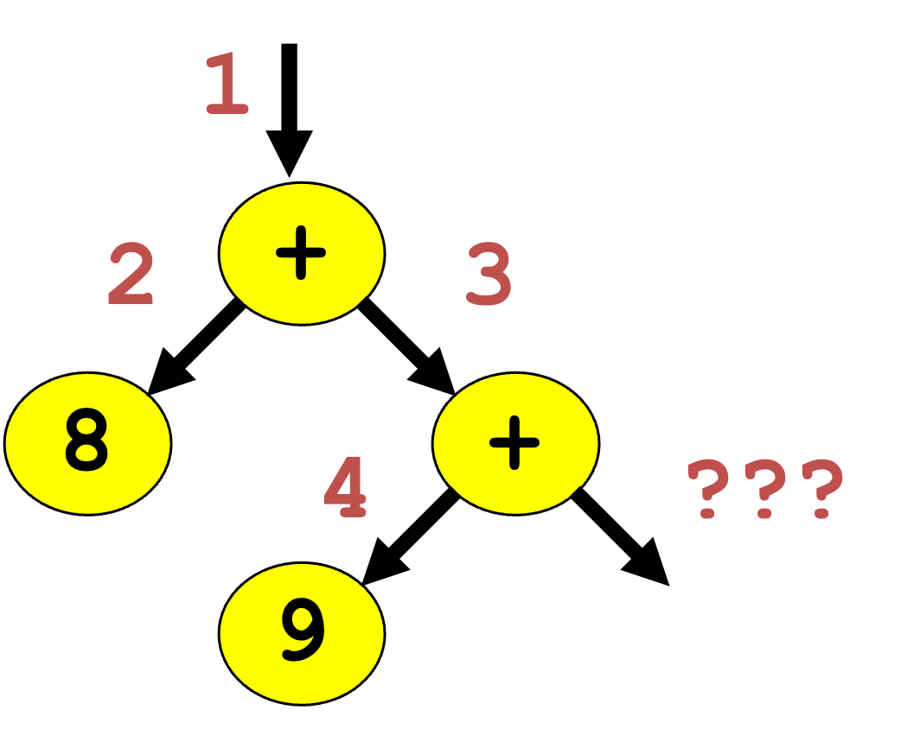

# Debugging with exceptions 

---
# Self-assessment
---

## Q1 - What is printed when we call `outer()`?
```c++
void inner() {
    throw std::runtime_error("boom");
}
void middle() {
    try {
        inner();
    } catch (const std::logic_error& e) {
        std::cout << "middle caught it\n";
    }
}
void outer() {
    try {
        middle();
    } catch (const std::runtime_error& e) {
        std::cout << "outer caught it\n";
    }
}
```
---
## Q1 Answer
```
outer caught it
```
- `middle`'s catch clause **doesn't match** — `logic_error` and
`runtime_error` are sibling branches of `std::exception`

- The runtime keeps walking up the call chain, until it finds `outer`'s catch, which matches. 

What if neither catch matched?
* the search keeps going past `outer` too, all the way out of `main`
* nothing anywhere matches, and then `terminate` is called. 
* No matching handler is a runtime failure, not a compile error.

---
### Q2 What will happen?

> What will happen if a destructor throws an exception while the stack is already unwinding from a different exception? 

---

### Q2 Answer
`terminate` is called immediately
- One exception in flight is fine. 
- A second one — thrown by a destructor firing *during* unwinding from the first — leaves the runtime with no sane way to decide which one you meant to handle, so it gives up entirely. 

> **Destructors should not throw exceptions** 

---

## What if your program terminates abnormally
- Segmentation fault
- Unhandled exception

> We can use a debugger to observe program behavior
- Watch the call stack
- Examine variable values
- Step into functions
- Intercept exception throwing

---

## An Example Program

```c++
./studio3 + 8 + 9 10 // (8 + (9 + 10))
./studio3 + + 9 9 10 // ((8 + 9) + 10)
```
Calculates prefix addition expressions


<style>
.image-row {
  display: grid;
  grid-template-columns: 1fr 1fr;
  gap: 3rem;
}
</style>

<div class="image-row">


</div>

---

## How can this program fail?

1. Wrong number of arguments passed
2. Arguments passed in wrong order

```c++
./studio3 + 8 + 9
```



---

## GDB Essentials

SSH to Linux workstation

- break - pause execution at a line or function
```gdb
break parse_and_compute
```
- run [ARGS] - run the program with command line argumenst
```gdb
run + 8 + 9
```
- print - print the value of a variable or expression
```gdb
print argv[current_index]
```

---

## GDB Essentials Continued

- where - show the program call stack
- step - step into the current function call
- next - exeute one line, stepping OVER any functions
- catch - catchpoint, to pause when exceptions are thrown or caught
```
catch throw     # stop when any exception is thrown
catch catch     # stop when any catch clause is entered
catch rethrow   # stop on a bare throw
```
- up - go up a stack frame
- down - go down a stack frame
- list - show the code around the current breakpoint

---

## GDB Demo

make
gdb studio3
(gdb) break parse_and_compute
(gdb) run + 8 + 9
(gdb) where         
(gdb) continue 

